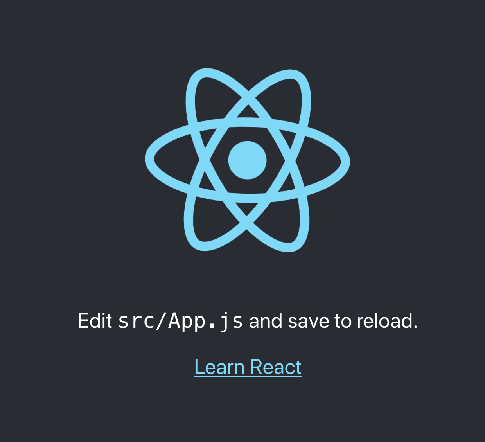
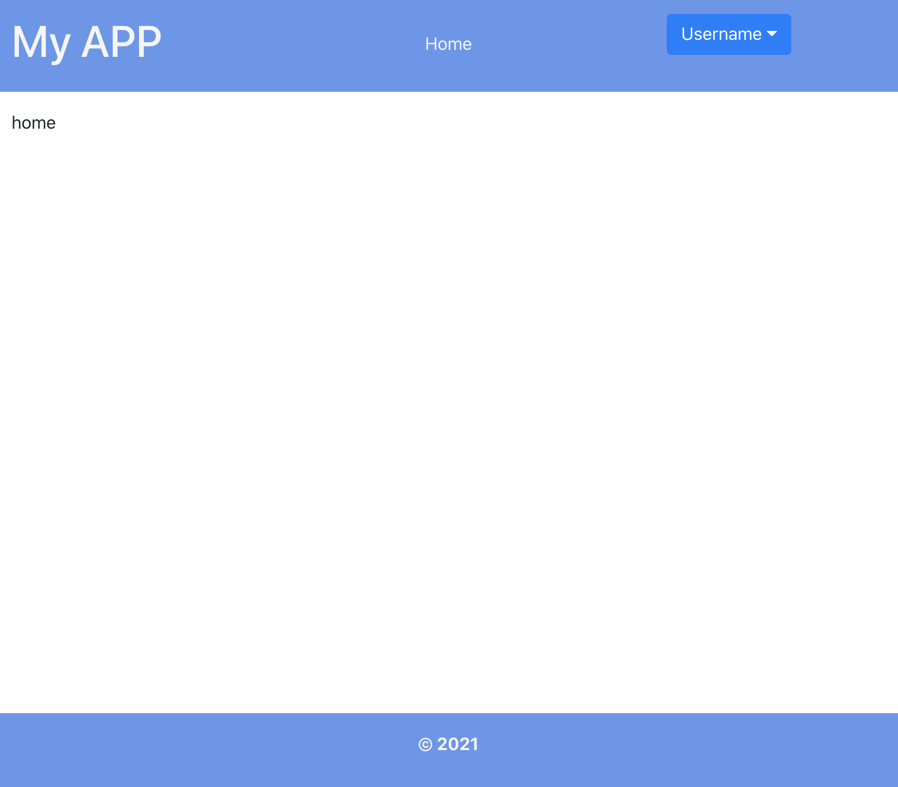
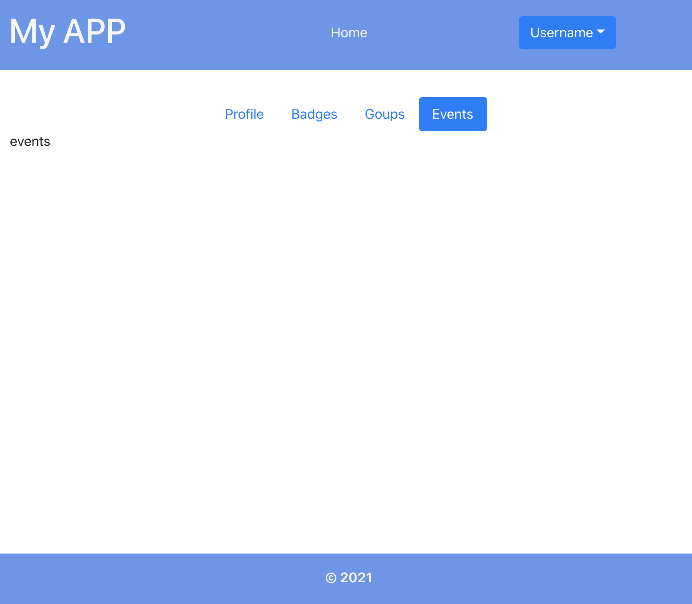

# APP React-Bootstrap

## Create React App

Crearemos nuestra aplicación usando Create React App, para crear nuestra aplicación de una forma sencilla. 

Primero ejecutamos en nuestra terminal el siguiente comando y usaremos npx, que viene con el manejador de paquetes npm. Una vez termine la ejecución del comando iremos a la carpeta creada y inicializaremos nuestra aplicación.

```bash
npx create-react-app my-app
cd my-app
npm start
```



## React-Bootstrap

React-Bootstrap son los componentes de Bootstrap adaptados a la librería de React. Cuando no sabemos mucho de diseño, usar una herramienta como Bootstrap, nos ayuda a ahorrarnos algo de tiempo y crear componentes que funcional y visualmente funcionan bien en nuestros proyectos.

Para usar React-Bootstrap solo necesitamos instalar react-bootstra usando nuestro manejador de paguetes:

```bash
npm install react-bootstrap bootstrap
```

Para hacer uso de nuestro componentes solo debemos importar nuestros componentes.

Usaremos SASS para permitirnos crear algunos elementos más reutilizables, entre otras caracteristicas que nos da SASS.

Para usarlo necesitamos instalarlo usando el siguinete comando:

```bash
npm install --save node-sass
```

Uns vez instalado renombraremos nuestro App.css to App.scss y dentro de el importaremos los estilos de SASS de Bootstrap. Además actualizaremos en nuestro App.js la hoja de estilos que modificamos: app.scss



```css
@import '~bootstrap/scss/bootstrap.scss';
```



## Creando algunas páginas y el Enrutamiento

Crearemos dos carpetas en la raiz, container y components, dentro del container colocaremos las caracteristicas importantes de nuestra aplicación, que serán nuestras páginas y en components, crearemos los elementos que reutilizaremos en nuestra aplicación.

### Routing o Enrutamiento

Una SPA \(Single Page Aplication\), tiene la característica de permitirnos crear una aplicación dinámica que no necesite recargarse para permitirnos navegar por los diferentes elementos de nuestra aplicación.

Necesitamos instalar react-router-dom

```css
npm install --save react-router-dom
```

Limpiaremos nuestro archivo App.js y modificaremos nuestra función.

El React Router tiene varios componentes necesarios para el enrutamiento, entre los más usados están: BrowserRouter, Switch, y Route.

En la raiz de nuestra aplicación o en el core debe de haber un componente de React Router como el BrowserRouter, que nos permite usar URL dinamicas o el HashRouter, para url estaticas.

Route, es un componente que nos permite crear nuestras rutas.

Switch, es un componente que devuelve la primera ruta que coincide, en lugar de todas las rutas coincidentes.

Link, es un componente que se usa en lugar de los anchor tags &lt;a&gt;&lt;/a&gt;.

Crearemos el componente con el que manejaremos nuestras rutas, en la carpeta components, llamado Router.js y en este incluiremos los componentes del Routing.



```javascript
import { BrowserRouter, Redirect, Route, Switch } from "react-router-dom";


const Router = () => (
  <BrowserRouter>
    </Switch>
  </BrowserRouter>
);

export default Router;

```



Incluiremos en nuestro App.js, nuestro componente Router,  y modificaremos un poco nuestro archivo.



```javascript
import Router from './components/Router';
import './App.scss';

const  App = () => (<Router />);

export default App;
```




### Home

Crearemos nuestro componente Home, en los container y los componentes Header y Footer en components. Crearemos en la carpeta container, una carpeta de Home con sus estilos.



```javascript
import './Home.scss';

const Home = () => <main className="main">home</main>;
export default Home;

```





```css
.main {
  height: 100%;
  padding: 1em;
  width: 100%;
}
```



Incluire el Home en las las rutas, incluiremos el componente &lt;Redirect&gt; que nos permite maneja la redirección en el caso de no incluir una ruta especifica en la url, y realizar de esta forma la redirección a home.



```javascript
import { BrowserRouter, Redirect, Route, Switch } from "react-router-dom";

import Home from './../container/Home/Home';

const Router = () => (
  <BrowserRouter>
    <Redirect
      from="/"
      to="/home" />
    <Switch>
      <Route path="/home" component={Home} />  
    </Switch>
  </BrowserRouter>
);

export default Router;
```



Crearemos un componente Header, donde incluiremos un menu, que nos permitirá poner los anchor, para la redirección en las páginas. Usaremos un componente de bootstrap para el menu.



```javascript
import { Link } from "react-router-dom";
import { Dropdown, Nav } from "react-bootstrap";

import "./Header.scss";

const Header = () => (
  <header className="header">
    <h1 className="header__logo">
      <Link className="link" to="/home">
        My APP
      </Link>
    </h1>
    <Nav className="header__menu" activeKey="/home">
      <Nav.Item>
        <Link className="link" to="/home">
          Home
        </Link>
      </Nav.Item>
    </Nav>
    <Dropdown className="header__user">
      <Dropdown.Toggle id="dropdown-basic">Username</Dropdown.Toggle>

      <Dropdown.Menu className="header__user__menu">
        <Link className="link" to="/logout">
          Logout
        </Link>
      </Dropdown.Menu>
    </Dropdown>
  </header>
);
export default Header;

```



Pondremos algunos estilos



```css
.header {
  background-color: cornflowerblue;
  display: flex;
  padding: 1em;
  & .link {
    color: whitesmoke;
  }
  &__logo{
    flex: 1;
  }
  &__menu {
    align-self: center;
    flex: 2;
    justify-content: center;
  }
  
  &__user{
    align-self: center;
    flex: 1;
    &__menu {
      display: flex !important;
      flex-direction: column;
      padding: .5em;
      .link {
        color: #807e7e;
      }
    }
  }
}
```



Añadiremos en el router nuestro Header.



```javascript
...
import Header from './../components/Header/Header';
...

const Router = () => (
  <BrowserRouter>
    <Header />
    ...
```



Creamos el componente Footer



```javascript
import './Footer.scss';

const Footer = () => (
  <footer className="footer">
    &copy; 2021
  </footer>
  );
export default Footer;

```



Incluimos un poco de estilos.



```css
.footer {
  background-color: cornflowerblue;
  bottom: 0;
  color: whitesmoke;
  font-weight: bold;
  padding: 1em;
  position: absolute;
  text-align: center;
  width: 100%;
}

```





### Perfil de usuario

Crearemos la página de perfil de usuario, que desde el dropdown de usuario, al darle clic en la opcion de perfil la prodremos visualizar.

En la carpeta container, crearemos una carpeta profile y dentro de ella el archivo de js y otro para los estilos.



```jsx
import './Profile.scss';

const Profile = () => <main className="profile">profile</main>;
export default Profile;
```





```jsx
import { Link } from "react-router-dom";
import { Dropdown, Nav } from "react-bootstrap";

import "./Header.scss";

const Header = () => (
  <header className="header">
    ...
    <Dropdown className="header__user">
      <Dropdown.Toggle id="dropdown-basic">Username</Dropdown.Toggle>

      <Dropdown.Menu className="header__user__menu">
        <Link className="link" to="/profile">
          Profile
        </Link>
        ...
      </Dropdown.Menu>
    </Dropdown>
  </header>
);
export default Header;

```



Incuiremos este nuevo archivo en el router, para que podamos usar el link ubicado en nuestro header.



```jsx
import { BrowserRouter, Redirect, Route, Switch } from "react-router-dom";

...
import Profile from './../container/Profile/Profile';

const Router = () => (
  <BrowserRouter>
    ...
    <Switch>
      ...
      <Route path="/profile" component={Profile} />  
    </Switch>
    <Footer />
  </BrowserRouter>
);

export default Router;
```



Crearemos un banner con 4 botones de bootstrap que apareceran centrados. Para esto usaremos un componente de Bootstrap llamado Tab que nos permitirá cambiar por las diferentes secciones facilmente.

Pondremos ademas de los Tab, una Nav, para las diferentes opciones o nuestros botones.



```jsx
import "./Profile.scss";
import { Nav, Row, Tab } from "react-bootstrap";

const Profile = () => (
  <main className="profile">
    <Tab.Container id="left-tabs-example" defaultActiveKey="first">
      <Row  className="justify-content-center">
        <Nav variant="pills" className="flex-row profile__menu">
          <Nav.Item >
            <Nav.Link eventKey="first">Profile</Nav.Link>
          </Nav.Item>
          <Nav.Item>
            <Nav.Link eventKey="second">Badges</Nav.Link>
          </Nav.Item>
          <Nav.Item>
            <Nav.Link eventKey="third">Goups</Nav.Link>
          </Nav.Item>
          <Nav.Item>
            <Nav.Link eventKey="fourth">Events</Nav.Link>
          </Nav.Item>
        </Nav>
      </Row>
      <Row>
        <Tab.Content className="profile__content">
          <Tab.Pane eventKey="first">Profile</Tab.Pane>
          <Tab.Pane eventKey="second">Badges</Tab.Pane>
          <Tab.Pane eventKey="third">Groups</Tab.Pane>
          <Tab.Pane eventKey="fourth">events</Tab.Pane>
        </Tab.Content>
      </Row>
    </Tab.Container>
  </main>
);

export default Profile;

```





```css
.profile {
  padding: 2em;
}

```





Para el contenido que vamos a mostrar por cada item, crearemos algunos componentes, estos componentes los incluiremos dentro del componente de Profile, porque van a ser solo para la sección del usuario. Crearemos una carpeta components y dentro unas carpetas adicionales: Badges, Groups, Events, y los incluiremos en nuestro componente Profile.



```jsx
import "./Badge.scss";

const Badge = () => (
  <section className="badge">
   Badge
  </section>
);

export default Badge;

```





```jsx
import "./Events.scss";

const Events = () => (
  <section className="events">
   Events
  </section>
);

export default Events;

```





```jsx
import "./Groups.scss";

const Groups = () => (
  <section className="groups">
   Groups
  </section>
);

export default Groups;

```



Pondremos estos componentes en nuestro Profile.js, primero en un index.js, exportaremos nuestros componentes.



```jsx
export { default as Badge } from './Badge/Badge';
export { default as Events } from './Events/Events';
export { default as Groups } from './Groups/Groups';
```





```jsx
import "./Profile.scss";
import { Nav, Row, Tab } from "react-bootstrap";
import { Badge, Events, Groups } from "./components";

const Profile = () => (
  <main className="profile">
    <Tab.Container id="left-tabs-example" defaultActiveKey="first">
      <Row className="justify-content-center">
        <Nav variant="pills" className="flex-row profile__menu">
          <Nav.Item>
            <Nav.Link eventKey="first">Profile</Nav.Link>
          </Nav.Item>
          <Nav.Item>
            <Nav.Link eventKey="second">Badges</Nav.Link>
          </Nav.Item>
          <Nav.Item>
            <Nav.Link eventKey="third">Goups</Nav.Link>
          </Nav.Item>
          <Nav.Item>
            <Nav.Link eventKey="fourth">Events</Nav.Link>
          </Nav.Item>
        </Nav>
      </Row>
      <Row>
        <Tab.Content className="profile__content">
          <Tab.Pane eventKey="first">Profile</Tab.Pane>
          <Tab.Pane eventKey="second">
            <Badge />
          </Tab.Pane>
          <Tab.Pane eventKey="third">
            <Groups />
          </Tab.Pane>
          <Tab.Pane eventKey="fourth">
            <Events />
          </Tab.Pane>
        </Tab.Content>
      </Row>
    </Tab.Container>
  </main>
);

export default Profile;

```



Para los Badges, vamos a crear un mock con la siguiente información, usando [https://designer.mocky.io/](https://designer.mocky.io/)

```javascript
[
  {
    avatar: "https://picsum.photos/200/300",
    name: "Networking",
    description: "You enjoy to do a lot of networking",
    intructions: "To get this badge you need to join to three events",
  },
  {
    avatar: "https://picsum.photos/200/300",
    name: "Profile completed",
    description: "You complete your profile",
    intructions: "To get this badge you need to complete your profile",
  },
  {
    avatar: "https://picsum.photos/200/300",
    name: "Social",
    description: "You like to belong to other groups",
    intructions: "To get this badge you need to belong to at least one group",
  },
  {
    avatar: "https://picsum.photos/200/300",
    name: "Learner",
    description: "You like to learn and participate of a lot of workshops",
    intructions: "To get this badge you assist to at least one workshop",
  },
]
```

En el componente badges usaremos las Card de Bootstrap, donde haremos un loop del api que creamos.

## Liks útiles:

Repositorio: [https://github.com/vanessamarely/react-bootstrap](https://github.com/vanessamarely/react-bootstrap)

Componentes UI:

* React Bootstrap: [https://react-bootstrap.github.io/](https://react-bootstrap.github.io/)
* Carbon: [https://www.carbondesignsystem.com/](https://www.carbondesignsystem.com/)
* Ant Design: [https://ant.design/docs/react/introduce](https://ant.design/docs/react/introduce)

Puebas unitarias:

* Jest: [https://jestjs.io/docs/getting-started](https://jestjs.io/docs/getting-started)
* React-testing library: [https://testing-library.com/docs/react-testing-library/intro/](https://testing-library.com/docs/react-testing-library/intro/)

Otros:

Nextjs: [https://nextjs.org/docs/getting-started](https://nextjs.org/docs/getting-started)


